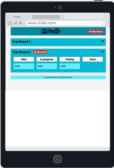
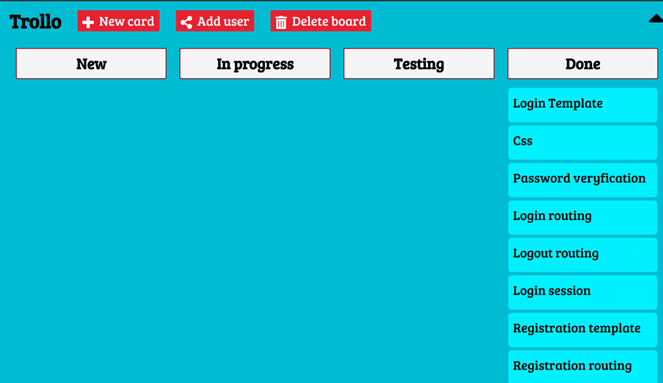

# ProMan

ProMan is one page application based on [Trello](http://trello.com).

## Concept

* Modify Duplicate of Trello
* Use database to share content with other users
* Website as one pager
* Using AJAX
* Proper sprint planning
* Use Django framework to show difference between Flask

## Features

* Great design and user-friendly UI
* Minimum requirements for input
* Responsive design
* Drag and drop between statuses
* Updating cards
* Sharing boards

## Requirements

* Python 3.6
* PostgreSQL
* Psycopg2
* Flask
* [Optional] Django

## Usage

First unzip this into folder and then open there terminal and run command for creating database:
```
sudo -u postgres psql <YOUR_DB_NAME>
\i SQL_database.sql
```
To run server type: `python server.py`

## Screenshots


